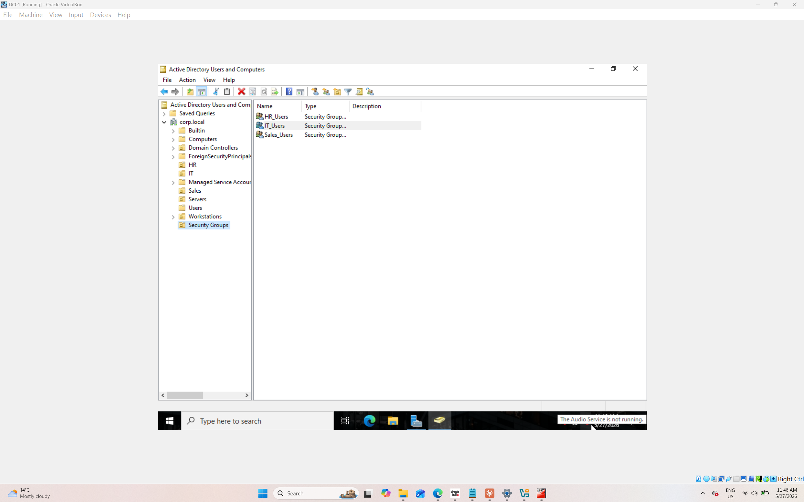
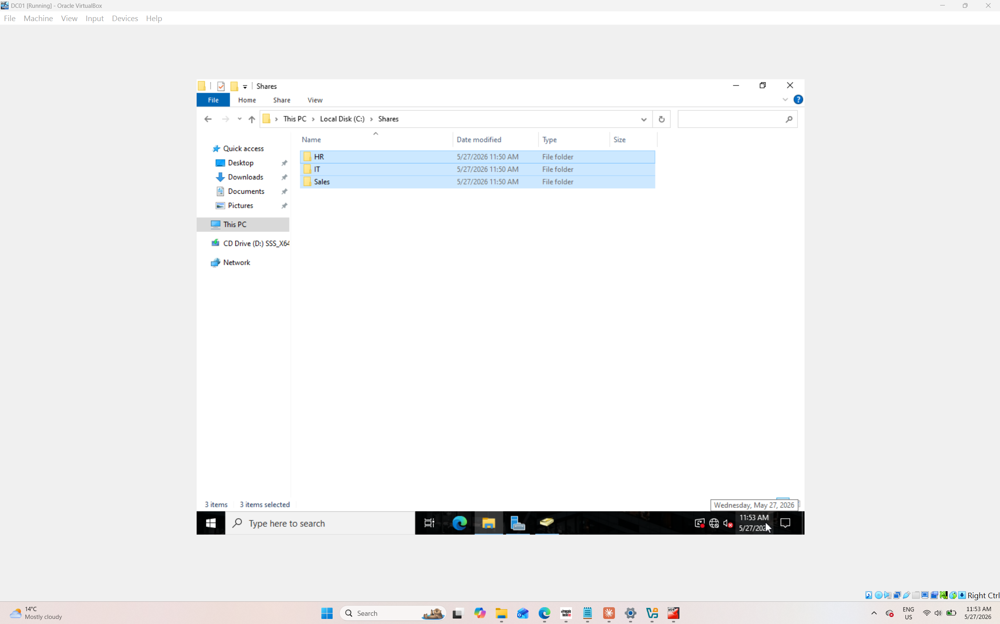
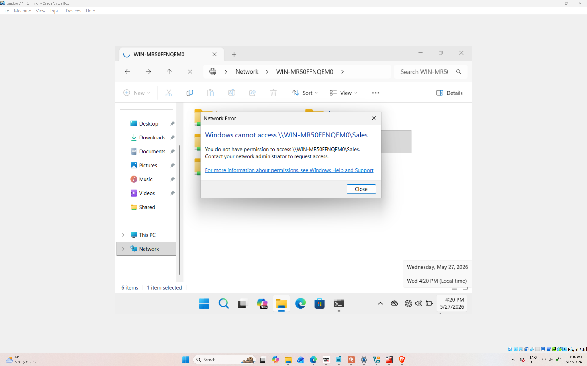
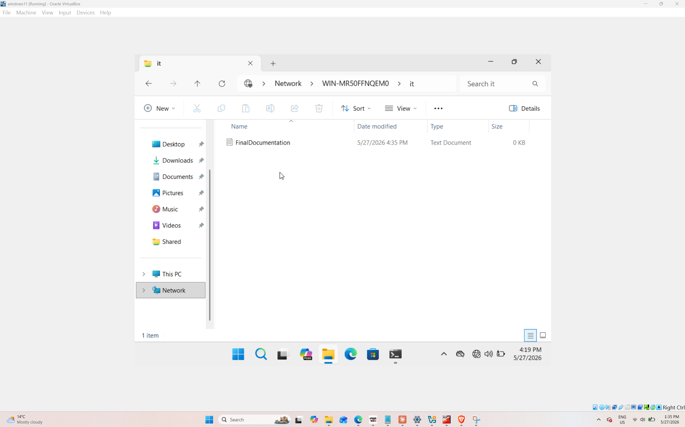
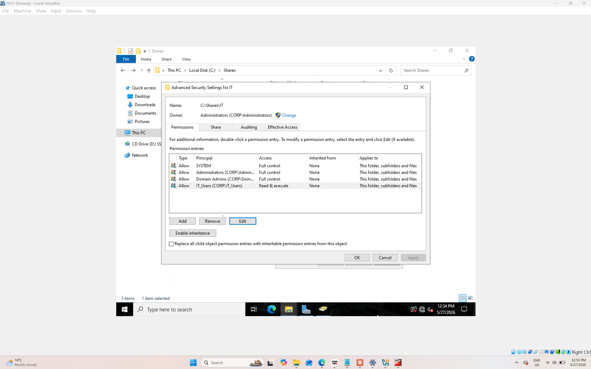
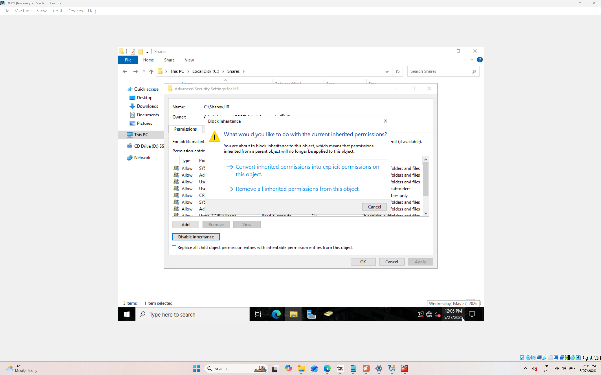

# File Share Permissions Lab – NTFS & Share Permissions

## Project Overview
This lab demonstrates practical skills in creating and securing file shares using proper NTFS and Share permissions in a Windows Active Directory environment. The project includes setting up departmental shares (HR, IT, Sales), creating security groups, configuring permissions, and troubleshooting access issues.

## Objectives
- Create departmental file shares with appropriate security
- Implement proper NTFS and Share permission best practices
- Troubleshoot and resolve access denied issues
- Document the permission structure for maintainability

## Lab Environment
- **Domain Controller**: Windows Server 2022
- **Client Machine**: Windows 11 joined to the domain
- **Active Directory**: Custom Organizational Units and Security Groups
- **File Server**: Windows Server with shared folders (HR, IT, Sales)

## What Was Built

### 1. Active Directory Security Groups
Created three security groups following best practices:
- `HR_Users`
- `IT_Users`
- `Sales_Users`

These groups were used to assign permissions instead of assigning permissions directly to users.

### 2. File Shares Created
- `HR` share
- `IT` share  
- `Sales` share

### 3. Permission Strategy Applied
- Used **explicit permissions** instead of inherited permissions where needed
- Blocked inheritance on sensitive folders (HR)
- Applied **least privilege principle** (Read & Execute for most users)
- Separated Share permissions and NTFS permissions properly

### 4. Troubleshooting Scenario
**Problem**: Windows client received "Access Denied" when trying to access the Sales share.

**Root Cause**: Incorrect or missing permissions on the share and/or NTFS level.

**Solution**: 
- Reviewed and corrected Share permissions
- Reviewed and corrected NTFS permissions
- Added the appropriate security group with correct access levels
- Verified access after changes

**Result**: Access was successfully granted after applying proper permissions.

## Key Learnings
- Importance of separating Share permissions vs NTFS permissions
- How to properly use security groups instead of individual user permissions
- How to troubleshoot access denied issues systematically
- Best practices for blocking inheritance on sensitive folders
- Documentation of permission structures for future maintenance

## Screenshots

### Active Directory Security Groups Created

### File Shares Created

### Access Denied Issue (Sales Share)

### Access Granted After Fixing Permissions

### NTFS Permissions – IT Share

### NTFS Permissions – HR Share (with inheritance blocked)

### Share Permissions Configuration
